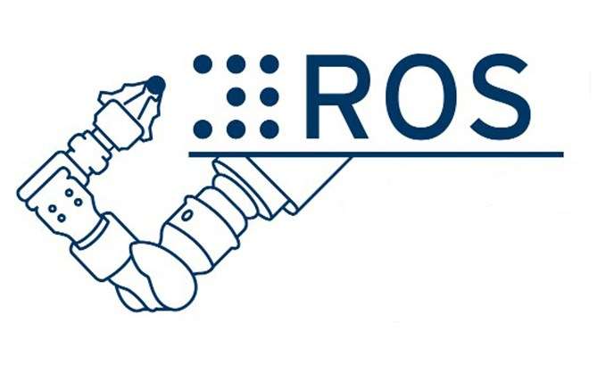
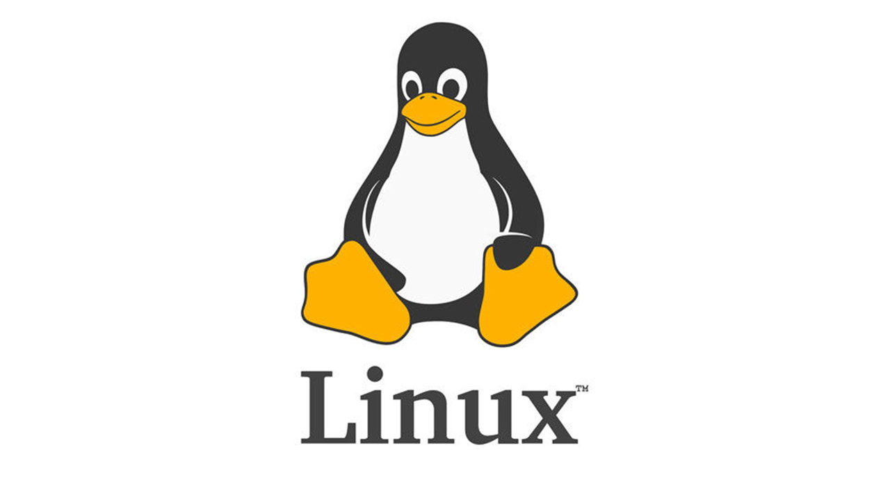

# Hi there! I'm Hamza 👋 

## I'm an embedded software engineer

- 🔭 I have no special talent. I am only passionately curious.
- 🌱 I like to solve operating systems and computer architecture problems.
- 🥅 Bare metal embedded software design, bootloader, communication porotocols(UART,I2C,SPI,TCP/IP,UDP), desktop applications designed by Qt and C++.
- 👋 ARM, RISCV, MIPS are the architecuteres that i dealed with also i was dealing with FPGA by using VHDL
- 👉 You can find my researches at https://www.researchgate.net/profile/Hamza-Karakus-2

### Connect with me:

[

[]

